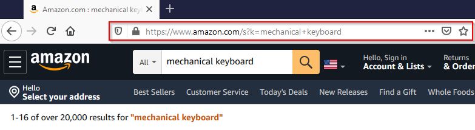
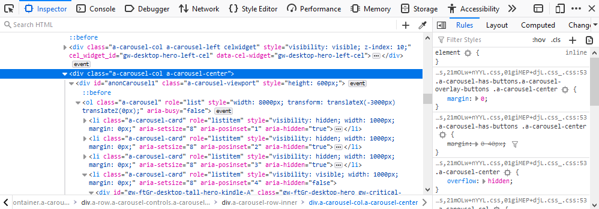
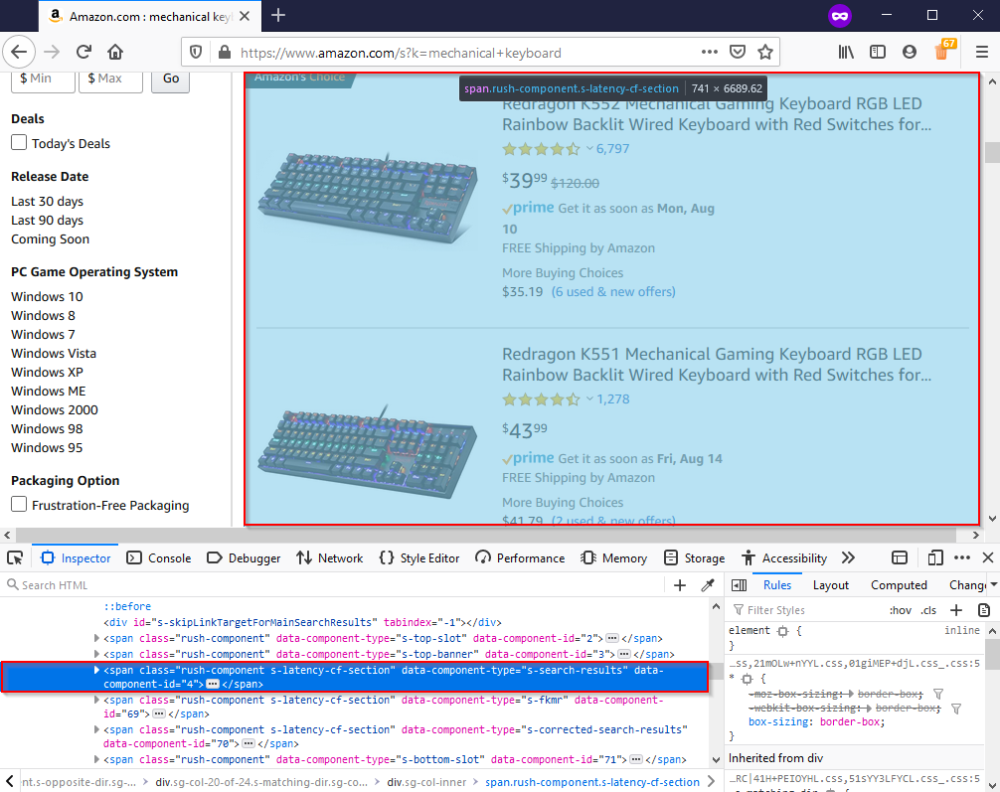

## Introduction

This post has four main parts to it: circumventing Amazon’s “bot detection”, scraping search results, then using archived versions of webpages to track price changes and graph them.

- The first part showcases some techniques to avoid detection via HTTP headers and cookie persistence, something that is relatively easy to do but effective. The next task is to (1) figure out how to send a search query request, (2) scrape the corresponding results, and (3) parse the data so it can be examined in a meaningful way.

- I switch gears after successfully scraping search results, to a process that might be more useful: tracking price data of a product. This idea comes from [CamelCamelCamel](https://camelcamelcamel.com/) (Camel), an amazon price tracker. I decide to use the [Wayback Machine](https://web.archive.org/), a massive web page archiving project, to view the price changes of a product over time. At the end I bring it all together with a neat little pandas project to graph the data

## General Overview

Each subsection is outlined within these four main ones, the code throughout will be available at the GitHub link at the end of this post.

- [Recon work: discover what we are up against](#recon-work-discover-what-we-are-up-against)
- [The Target: Amazon Search Results](#the-target-amazon-search-results)
- [A New Task: Getting a Product’s Price History](#a-new-task-getting-a-products-price-history)
- [Mission Complete: Representing our Data](#mission-complete-representing-our-data)

## Requirements

In order for everything listed in this guide to work, you will need the following:

- [Python 3.8](https://www.python.org/ftp/python/3.8.5/python-3.8.5.exe)

- [BeautifulSoup4](https://www.crummy.com/software/BeautifulSoup/bs4/doc/) | `pip install bs4`
- [Requests](https://requests.readthedocs.io/en/master/) | `pip install requests`
- [Pandas](https://pandas.pydata.org/getting_started.html) | `pip install pandas`

## Recon Work: Discover What We are Up Against


Figure: Photo by [Byran Angelo](https://unsplash.com/@bryanangelo) on [Unsplash](https://unsplash.com/s/photos/amazon)

In any web-scraping project it’s important to first do some testing, because usually things don’t go exactly as planned. There are lots of different reasons for this as we will see in this guide, but I am warning you of this so that you don’t get frustrated. A lot of the time you aren’t even doing anything wrong either, it’s just a part of the process. Let's start with a basic request and see what's going on:

```python frame="terminal" title="Python REPL"
>>> with requests.get("https://www.amazon.com") as response:
...    print(response)
<Response [503]>
```

Usually, we want our response status code to be 200, which indicates a successful request. A 503 response code generally means service unavailable. This would deter most people right off the bat (which is what sites want), however let's see if the site provides any other kind of message or clues as to why we have been so rudely stopped. After looking through some of the response text, we can see that Amazon isn’t happy with “automated access” attempt:

```python
"To discuss automated access to Amazon data please contact api-services-support@amazon.com."
```

So how does Amazon know this? They can pin our request as automated because we didn’t change any of our default request [headers](https://developer.mozilla.org/en-US/docs/Web/HTTP/Headers) that make us look like a real browser. We can inspect the headers that accompanied the request above using `response.request.headers`

```json
{
  "User-Agent": "python-requests/2.24.0",
  "Accept-Encoding": "gzip, deflate",
  "Accept": "*/*",
  "Connection": "keep-alive"
}
```

The main header to look at here is the one called `User-Agent`. This header identifies what client a request is coming from, usually a modern web-browser. Right now it is set to `python-requests/2.24.0` which doesn’t look like a real browser.

A normal user agent should look something like this:

```python
"Mozilla/5.0 (Windows NT 10.0; rv:78.0) Gecko/20100101 Firefox/78.0"
```

The user-agent string above indicates that the request is coming from a Windows computer using Firefox, which is much more believable than the default `python-requests` variant that is usually identified as an automated script.

### Second Attempt: Utilizing the User-Agent Header

The first step in making your bot look like a “real person” is by simply modifying this default user agent to one that looks more legitimate. Let’s try again and see what happens:

```python frame="terminal" title="Python REPL"
>>> headers = {"User-Agent": "Mozilla/5.0 (Windows NT 10.0; rv:78.0) Gecko/20100101 Firefox/78.0"}
>>> with requests.get("https://www.amazon.com", headers=headers) as response:
 ...     print(response)
# <Response [200]>
```

Now it looks like we are done, because we have a successful status code, but let's look closer to make sure we are getting what we want. Take this as a reminder to always double check and MAKE sure you have what you want or else you will spend a lot of time scratching your head later on. After looking at the text more closely, the request has reached the server but our request failed to make it to the normal homepage.

```python
"To discuss automated access to Amazon data please contact api-services-support@amazon.com."
```

You might be even more discouraged at this point, but we are one step closer to finding our way around Amazon’s automated detection system. Amazon is letting us in the front door (status code 200), but something is missing and causing us to get booted out. As an analogy, it’s like getting into an airport but then not being able to get past security.

### Third Attempt: Using a Referer

I feel like now is a good time to introduce the phrase I came up with a few minutes ago that holds true a lot of the time: “when in doubt, header it out”. I think the power of headers is often underrated in web-scraping.

There is another request header that browsers usually provide, and it’s called [Referer](https://developer.mozilla.org/en-US/docs/Web/HTTP/Headers/Referer). It’s purpose is sort of self-explanatory, it provides basic information on where the visitor came from.

For example, a common `Referer` would be Google, since you often visit webpages from google’s search engine. Often times, a key identifying feature of bots is visiting a site out of thin air (directly requesting the source), which is usually not how humans normally visit links. However, we can use our own `Referer` header to make it look like we actually did come from another site, making our request look more human-like, and therefore legitimate.

```python frame="terminal" title="Python REPL"
>>> headers.update({"Referer":"https://www.google.com/search?q=amazon"})  # Update our original headers
>>> with requests.get("https://www.amazon.com", headers=headers) as response:
...     print(response)
# <Response [200]>
```

Now upon further inspection we can see that we are now at the actual homepage of Amazon, we did it! However, the request above also looked identical with a 200 status code, but was clearly unsuccessful. Knowing before we start parsing the page is valuable because it will save a lot of time by shutting down the script before it’s inevitable failure.

### Testing for Success

There are a few ways of testing for success:

- Checking response cookies to see if we have initiated a session token (some sites don’t have this)
- Check for the presence / lack of conditional text (usually less accurate)
- Sometimes response code is enough (super simple, however doesn’t work in all cases like this one)

```python frame="terminal" title="Python REPL"
>>> response.cookies.keys()
['i18n-prefs', 'session-id', 'session-id-time', 'skin']
```

We can see that our response now contains cookies that it didn’t contain before such as `session-id` which basically means we are free to browse the site now. It’s important to note that so far we have been using single requests `requests.get()` which does not save headers or cookies, requiring us to set them each time we make a request. This becomes a major pain, but luckily we can avoid all of this by using session `requests.Session()` which automatically sets cookies and headers for us through multiple requests.

```python frame="terminal" title="Python REPL"
>>> with requests.Session() as s:
...    s.headers = {'User-Agent': 'Mozilla/5.0 (Windows NT 10.0; rv:78.0) Gecko/20100101 Firefox/78.0', 'Referer': 'https://www.google.com/search?q=amazon'}  # Set our desired headers
...    s.get("https://www.amazon.com")
...    print(s.cookies.keys())
['i18n-prefs', 'session-id', 'session-id-time', 'skin']
```

Note that here we are looking at the session cookies, instead of cookies from our response. The cookies are now set for the remainder of our session. We can now access the amazon homepage, which is great, but what about some more practical uses such as searching for products or getting prices?

## The Target: Amazon Search Results

First let’s do some investigating to see what happens during an amazon search:



By searching for something manually, we can inspect the url: [https://www.amazon.com/s?k=mechanical+keyboard](https://www.amazon.com/s?k=mechanical+keyboard). Our search `mechanical keyboard` is appended to the base `search_url` under the parameter `k` after replacing the `space` with a `plus`. Knowing this, we can now create a function `search_amazon()` which will build the search request, and return the search results if the request was successful.

### Building the Method

```python
headers = {'User-Agent': 'Mozilla/5.0 (Windows NT 10.0; rv:78.0) Gecko/20100101 Firefox/78.0', 'Referer': 'https://www.google.com/search?q=amazon'}
def search_amazon(query: str):
    search_url = f'https://www.amazon.com/s?k={query.replace(" ", "+")}'
    with requests.get(search_url, headers=headers) as resp:
        return resp.text if resp.ok else None
```

Now we have created a function that will return the search results of the specified query! That’s great, but it would be nice if we could parse the search results instead of having a big blob of HTML to look through. The hard part of actually getting to the page is now done and all we have to do is parse the response text using an extremely helpful library called [BeautifulSoup4](https://beautiful-soup-4.readthedocs.io/en/latest/). The second part of this guide will be a step-by-step process of elegantly parsing the key information so that we have the freedom to format it however we want. The next section focuses on how we identify elements within the website’s code, so we can then make use of methods such as `find()`, `find_all()` and `select()` to get our information.

### A Brief Lesson on BeautifulSoup

Here is an extremely brief example using our `search_amazon()` method we created above to get the corresponding results page:

```python frame="terminal" title="Python REPL"
>>> page = search_amazon("mechanical keyboard")
>>> soup = BeautifulSoup(page, "lxml")  # Let's make our soup
>>> soup.title.text
Amazon.com : mechanical keyboard
```

The process for parsing BeautifulSoup is pretty simple:

- Step 1: Request a webpage and get a response
- Step 2: Access the HTML by using `response.text`
- Step 3: Make the soup using BeautifulSoup(response.text, “html.parser”)
- Step 4: Parse away using the variety of methods bs4 gives you access to!

### The Ultimate Web-scraping Tool: Inspect Element

In my experience, inspect element, is the most useful tool when it comes to web-scraping. To be able to scrape elements using attributes and see how they are structured, we need to be able to inspect the webpage’s code. It’s in every modern browser and most of you are probably somewhat familiar with it. The default shortcut is usually the same across browsers but differs on operating system.



| Operating System(s) | Keyboard Shortcut(s)        |
| ------------------- | --------------------------- |
| Windows / Linux     | `Ctrl`+`Shift`+`C` or `F12` |
| Mac OS              | `Cmd`+`Shift`+`C`           |

If you still have the search page open from earlier you can use that page or just search for something random in order to get to the page with the search results listed. Our goal is to figure out what elements contain the search results. Once we have narrowed down the search results we can then get the required information such as name or price from each.



In the above picture I have outlined the element which contains our search results as indicated by the outlined blue box (which covers all the search results). The goal is to get all the search results with as little “extra” stuff as possible. You can also use attributes as clues, for example the attribute in question caught my eye because of this: `data-component-type="s-search-results"`. Looking under this element we are now trying to find what holds each individual result, after looking through some very messy divs, I find the results are all in a div with the attribute `data-component-type="s-search-result"`. We aren’t done yet, but by knowing this we can at least do the heavy lifting of getting our list of (not yet parsed) results which we will then extract the necessary information from. Next we will learn how to scrape and format these results into actually usable data.

### Cleanup: Gathering & Formatting the Results

```python frame="terminal" title="Python REPL"
search_results = soup.find_all("div", attrs={"data-component-type":"s-search-result"})
len(search_results)
22
```

Now that we have all of the “blocks” of soup containing our desired results, we need to decide what information we want to parse. The following is a list of information one might want to know from a result:

- Listing name and ID Number
- Rating and review count
- Price, shipping, and prime availability
- Product image URL

From this, we can design our class that will hold each individual result and nicely package it for further use:

```python
from dataclasses import dataclass
@dataclass
class SearchResult:
     id: str
     name: str
     stars: str
     review_count: int
     price: int
     is_prime: bool
     has_free_shipping: bool
     image_url: str
```

The class above utilizes the new `@dataclass` [decorator in Python 3.7](https://docs.python.org/3/library/dataclasses.html), which saves a lot of time writing an `__init__()` method with a ton of values. We have an idea of what we are getting now, so now we have to identify the elements containing our desired values within each listing. The method below takes a single `result` from our list of results and returns a `SearchResult` object with our specified properties. We will build on this method later but the idea is we can use simple list comprehension to make it more efficient: `[parse_result(result) for result in search_results]`.

### Parsing our Result Properties

```python
def parse_result(result):
    if not result:
        return
    name = result.h2.span.text
    id = result.get("data-asin")
    if price_section := result.select_one("span.a-price"):
        price = price_section.span.text
    else:
        price = None
    if rating_section := result.select_one("div.a-size-small"):
        stars = rating_section.select_one("span").get("aria-label")
        review_count = rating_section.select_one("span.a-size-base").text
    else:
        stars, review_count = None, None
    prime = result.find("i", attrs={"aria-label": "Amazon Prime"}) is not None
    free_shipping = result.find("span", attrs={"aria-label": "FREE Shipping by Amazon"}) is not None
    image_url = result.select_one("img.s-image").get("src")
    return SearchResult(id, name, stars, review_count, price, prime, free_shipping, image_url)
```

While the function may look a bit daunting at first, it is pretty simple. Each piece is really just selecting an element or one of its attributes. Selecting an attribute sometimes requires to test if it exists first before we try and access it (if the element isn’t always present). The function `parse_result()` returns our now tidy `SearchResult` object, allowing us to access things like its name with `result.name` or price with `result.price` etc. Since we used the dataclass decorator, printing our results looks pleasing and we didn’t even have to write a `__str__()` method!

```python frame="terminal" title="Python REPL"
>>> with requests.get("https://www.amazon.com/s?k=mechanical+keyboard", headers=headers) as response:
...    soup = BeautifulSoup(response.text, "html.parser")
...    results = soup.find_all("div", attrs={"data-component-type":"s-search-result"})
...    print([parse_result(result) for result in results])
[
    SearchResult(
    id='B016MAK38U',
    name='Redragon K552 Mechanical Gaming Keyboard[...]',
    stars='4.4 out of 5 stars',
    review_count='6,913',
    price='$39.99',
    is_prime=True,
    has_free_shipping=True,
    image_url='https://m.media-amazon.com/images/I/71cngLX2xuL._AC_UY218_.jpg'
    ), ...
]
```

At this point we have accomplished the basic task of searching for a product, and parsing the results into a nice format which can in turn be translated into pretty much anything. So, we can get the first page of results for any search we want, but what if we wanted to get 5 or even 10 pages of results? Let’s create a function that takes a search query and the number of pages to scrape which returns a list of search results.

### The Finished Product

I have created a class called `SearchResultScraper` using our previous code in order to keep everything together and for maintaining session state. We want each instance to have its own session to avoid being blocked based on session data (which would kill all instances).

**If you want to skip the explanation the full code is provided at the bottom of the section.**

First, a small utility class for fetching random user agents from a file:

```python title="Utils - Random User Agent Helper"
from typing import List
import logging
import requests
from bs4 import BeautifulSoup
import time
import itertools
import random

class Utils:
    @classmethod
    def fetch_random_ua(cls):
        with open('user-agents.txt') as ua_file:
            user_agents = ua_file.read().splitlines()
        if user_agents:
            return {"User-Agent": random.choice(user_agents)}
        else:
            return None
```

Next, the `SearchResultScraper` class. Each instance maintains its own session with spoofed headers, and can reset itself with a fresh user agent if blocked:

```python title="SearchResultScraper - Session + Search"
class SearchResultScraper:
    MAX_RETRIES = 3
    WAIT_TIME = 5
    headers = {
        'User-Agent': 'Mozilla/5.0 (Windows NT 10.0; rv:78.0) Gecko/20100101 Firefox/78.0',
        'Referer': 'https://www.google.com/search?q=amazon',
    }

    def __init__(self):
        self.session = requests.Session()
        self._update_headers(**self.headers)

    def _update_headers(self, **headers):
        for k, v in headers.items():
            self.session.headers.update({k: v})

    def search(self, query: str, page: int = 0) -> str:
        search_url = f'https://www.amazon.com/s?k={query.replace(" ", "+")}'
        if page > 1:
            self.session.headers.update(Referer=f'{search_url}&page={page - 1}')
            search_url += f'&page={page}'
        with self.session.get(search_url) as response:
            return response.text if response.ok else None

    def _reset_session(self):
        self.session = requests.Session()
        random_ua = Utils.fetch_random_ua()
        self._update_headers(Referer=self.headers["Referer"], **random_ua)
```

The `get_results` method handles pagination and retries. If a page fails to load, it resets the session with a new user agent and tries again:

```python title="SearchResultScraper - Pagination & Retry Logic"
    def get_results(self, query: str, pages: int = 1)  -> List[SearchResult]:
        result_pages = []
        for n in range(pages):
            retries = 0
            while retries < self.MAX_RETRIES:
                logging.info(f"Fetching search results for query: '{query}' | Page {n + 1}/{pages}")
                results = self._locate_results(query, n + 1)
                if results:
                    logging.info(f"Successfully located {len(results)} results on page {n + 1}")
                    result_pages.append(self.parse_results(results))
                    break
                else:
                    retries += 1
                    logging.error(
                        f"Unable to locate search results, retrying ({retries}/{self.MAX_RETRIES}) in {self.WAIT_TIME} seconds...")
                    self._reset_session()

                    time.sleep(self.WAIT_TIME)
        parsed_results = list(itertools.chain.from_iterable(result_pages))
        logging.info(f"Returning a total of {len(parsed_results)} results from {pages} pages")
        return parsed_results

    def _locate_results(self, query: str, n):
        page = self.search(query, n)
        if page:
            results = self.find_results(page)
            return results
```

Finally, the product details (name, price, rating, etc) are then parsed from each search result element.

```python title="SearchResultScraper - Result Parsing"
    @staticmethod
    def find_results(page: str):
        soup = BeautifulSoup(page, "html.parser")
        return soup.find_all("div", attrs={"data-component-type": "s-search-result"})

    @classmethod
    def parse_results(cls, results):
        return [cls._parse_result(result) for result in results]

    @classmethod
    def _parse_result(cls, result):
        if result:
            name = result.h2.span.text
            id = result.get("data-asin")
            if price_section := result.select_one("span.a-price"):
                price = price_section.span.text
            else:
                price = None
            if rating_section := result.select_one("div.a-size-small"):
                stars = rating_section.select_one("span").get("aria-label")
                review_count = rating_section.select_one("span.a-size-base").text
            else:
                stars, review_count = None, None
            prime = result.find("i", attrs={"aria-label": "Amazon Prime"}) is not None
            free_shipping = result.find("span", attrs={"aria-label": "FREE Shipping by Amazon"}) is not None
            image_url = result.select_one("img.s-image").get("src")
            return SearchResult(id, name, stars, review_count, price, prime, free_shipping, image_url)
```

<details>
<summary>View the complete code</summary>

```python title="search_result_scraper.py"
from typing import List
import logging
import requests
from bs4 import BeautifulSoup
import time
import itertools

class Utils:
    @classmethod
    def fetch_random_ua(cls):
        with open('user-agents.txt') as ua_file:
            user_agents = ua_file.read().splitlines()
        if user_agents:
            return {"User-Agent": random.choice(user_agents)}
        else:
            return None


class SearchResultScraper:
    MAX_RETRIES = 3
    WAIT_TIME = 5
    headers = {
        'User-Agent': 'Mozilla/5.0 (Windows NT 10.0; rv:78.0) Gecko/20100101 Firefox/78.0',
        'Referer': 'https://www.google.com/search?q=amazon',
    }

    def __init__(self):
        self.session = requests.Session()
        self._update_headers(**self.headers)

    def _update_headers(self, **headers):
        for k, v in headers.items():
            self.session.headers.update({k: v})

    def search(self, query: str, page: int = 0) -> str:
        search_url = f'https://www.amazon.com/s?k={query.replace(" ", "+")}'
        if page > 1:
            self.session.headers.update(Referer=f'{search_url}&page={page - 1}')
            search_url += f'&page={page}'
        with self.session.get(search_url) as response:
            return response.text if response.ok else None

    def _reset_session(self):
        self.session = requests.Session()
        random_ua = Utils.fetch_random_ua()
        self._update_headers(Referer=self.headers["Referer"], **random_ua)

    def get_results(self, query: str, pages: int = 1)  -> List[SearchResult]:
        result_pages = []
        for n in range(pages):
            retries = 0
            while retries < self.MAX_RETRIES:
                logging.info(f"Fetching search results for query: '{query}' | Page {n + 1}/{pages}")
                results = self._locate_results(query, n + 1)
                if results:
                    logging.info(f"Successfully located {len(results)} results on page {n + 1}")
                    result_pages.append(self.parse_results(results))
                    break
                else:
                    retries += 1
                    logging.error(
                        f"Unable to locate search results, retrying ({retries}/{self.MAX_RETRIES}) in {self.WAIT_TIME} seconds...")
                    self._reset_session()

                    time.sleep(self.WAIT_TIME)
        parsed_results = list(itertools.chain.from_iterable(result_pages))
        logging.info(f"Returning a total of {len(parsed_results)} results from {pages} pages")
        return parsed_results

    def _locate_results(self, query: str, n):
        page = self.search(query, n)
        if page:
            results = self.find_results(page)
            return results

    @staticmethod
    def find_results(page: str):
        soup = BeautifulSoup(page, "html.parser")
        return soup.find_all("div", attrs={"data-component-type": "s-search-result"})

    @classmethod
    def parse_results(cls, results):
        return [cls._parse_result(result) for result in results]

    @classmethod
    def _parse_result(cls, result):
        if result:
            name = result.h2.span.text
            id = result.get("data-asin")
            if price_section := result.select_one("span.a-price"):
                price = price_section.span.text
            else:
                price = None
            if rating_section := result.select_one("div.a-size-small"):
                stars = rating_section.select_one("span").get("aria-label")
                review_count = rating_section.select_one("span.a-size-base").text
            else:
                stars, review_count = None, None
            prime = result.find("i", attrs={"aria-label": "Amazon Prime"}) is not None
            free_shipping = result.find("span", attrs={"aria-label": "FREE Shipping by Amazon"}) is not None
            image_url = result.select_one("img.s-image").get("src")
            return SearchResult(id, name, stars, review_count, price, prime, free_shipping, image_url)
```

</details>

Now we have pretty much conquered Amazon when it comes to search results, which is still a pretty cool accomplishment, but I wanted to switch gears and try something else. This idea came from CamelCamelCamel (Camel) and is pretty simple but requires some problem solving. It is an Amazon price tracker that basically graphs a products price changes over time, telling you the highest, lowest, and current price.

## A New Task: Getting a Product's Price History


Figure: Photo by [Jason Briscoe](https://unsplash.com/@jsnbrsc) on [Unsplash](https://unsplash.com/s/photos/stock)

Essentially what we need to do is find a way to get older versions of the Amazon product page, and then scrape the price element from there, noting the timestamp of the snapshot. There is actually a website that does exactly this, you’ve probably even heard of it: the Wayback Machine! It’s the biggest web page archive site in the entire world containing around half a trillion web pages right now. We are lucky because Amazon is a high traffic website, meaning more snapshots and more data.

### Working with the Wayback Machine

The rest of this post will be focused with accomplishing the task of getting snapshots for a specific product page, noting the price and time for each snapshot, to eventually plot the data into a nice looking graph using Pandas. The first step, and probably the most time-consuming is trying to figure out how we are going to access the archives programmatically. After doing some research and finding surprisingly little information on the archive’s API, I finally found at least a way list timestamps using cdx. Below is the file named `wayback.py` which I used to put the methods related to the retrieval of archived content:

```python
# wayback.py

def get_capture_timestamps(url) -> List[str]:
    with requests.get(f"https://web.archive.org/cdx/search/cdx?url={url}*&fl=timestamp,statuscode&collapse=timestamp:10&filter=!statuscode:503") as resp:
        if resp.ok:
            return [line.split()[0] for line in resp.text.splitlines()]

def get_capture(url, timestamp) -> (str, str):
    with requests.get(f"https://web.archive.org/web/{timestamp}im_/{url}") as response:
        return response.text if response.ok else None, timestamp
```

### Parsing the Captured Pages

We basically get a list of `timestamps` corresponding to captures of our Amazon product page, which we will then individually visit and scrape the price from. The method `get_price_history` takes an amazon price URL, and then uses the methods above to get the timestamps which are used to craft the specific capture URLs. It then selects the price using `span#priceblock_ourprice` which seemed to be the most reliable selector (didn’t change much over time), although sometimes it contains 2 spans which need to be filtered out.

```python
def get_price_history(url):
    timestamps = wayback.get_capture_timestamps(url)
    captures = [wayback.get_capture(url, timestamp) for timestamp in timestamps]
    prices = {}
    for capture, timestamp in captures:
        if capture:
            soup = BeautifulSoup(capture, "html.parser")
            if buybox := soup.select_one("span#priceblock_ourprice"):
                if "\n" in (price := buybox.text.strip()):
                    price = buybox.select_one("span.a-offscreen").text.strip()
                prices[timestamp] = price
    return prices
```

The method returns a dictionary of `timestamp: price` entries, which are a convenient format for our next task of plotting our data with a pandas `Series` object. To give you an idea of what the output is currently looking like, and why we might want it in a more readable format:

```python
{'20190720031823': '$141.99', '20190726212605': '$138.99', '20190729082959': '$138.85', '20190805122522': '$138.85', '20190819131544': '$133.42', '20190826164017': '$129.99', '20191029102102': '$143.99', '20191105134838': '$143.99', '20191112121053': '$143.99', '20200621145317': '$89.99'}
```

## Mission Complete: Representing our Data


Figure: Photo by [Lukas Blazek](https://unsplash.com/@goumbik) on [Unsplash](https://unsplash.com/s/photos/data)

```python
def graph_price_history(url):
    price_history = get_price_history(url)
    timestamps = [datetime.strptime(ts, "%Y%m%d%f") for ts in price_history.keys()]
    prices = [int(float(price.lstrip("$"))) for price in price_history.values()]
    index = pd.DatetimeIndex(data=timestamps)
    series = pd.Series(prices, index)
    ax = series.plot()
    ax.set(xlabel="Date", ylabel="Price (USD)", title=f'{url.split("/")[3].replace("-", " ")} ({url.split("/")[-1]})')
```

Well, that is a surprisingly small amount of code for graphing two completely different datatypes, something pandas excels at. Let’s try this puppy out on [this](https://www.amazon.com/Redragon-K552-Mechanical-Keyboard-Equivalent/dp/B016MAK38U) product page and see how it looks:


Figure: **Web-scraping + Pandas = <3**

It’s pretty amazing what you can do with web scraping in combination with libraries like pandas that can help you represent the data you collect. There is definitely room to improve here, one issue is that the archives currently don’t have a ton of data points for most product pages, a lot of them resulting in page errors, but usually it’s enough to at least get by. Also the graph could be modified to fit the data better and the price selecting could probably be a bit more precise. Overall though, I think this is a great way to demonstrate the progression in a web scraping environment, through the testing phases to data parsing and then formatting for practical use.

## Conclusion

A lot of web scraping is in the process, and that’s what I love about it. There is nothing more exciting than finally getting the right selector for the data you have been searching for, nothing more exciting than getting around some roadblock that had you stuck for hours. And it’s so useful in our world right now where our access to open data is almost limitless and there are so many cool libraries like pandas that will help you present your findings. This guide is a lot longer than I first thought, but I think it ties together everything quite nicely with two slightly different projects that evolved over time. I hope you enjoyed, let me know if you have any suggestions for what to do next or if you have any questions!
