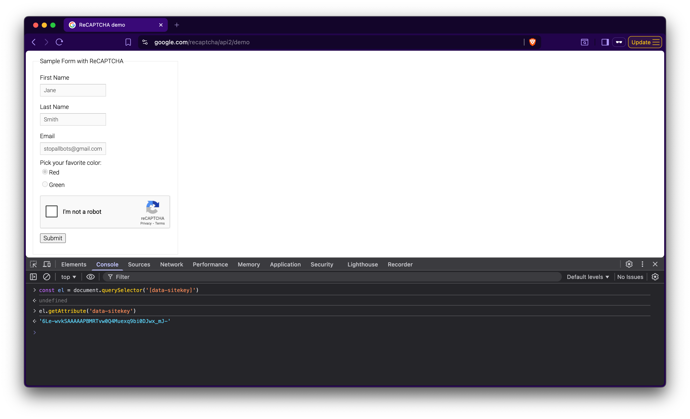
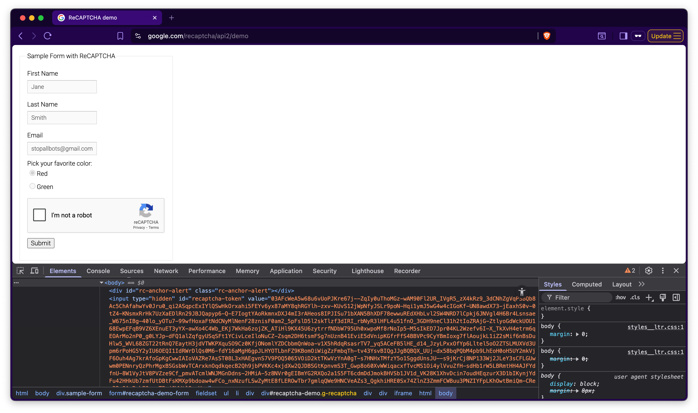

> ✏️ Update
>
> It is now a pretty well known fact that CAPTCHA has been a trojan horse for [unfettered spying and tracking by Google](https://techstory.in/study-exposes-privacy-risks-and-ineffectiveness-of-googles-recaptcha-system/).
> It has been proven to not be effective in actually stopping bots while being a major pain in the ass for humans.
> This post was originally written before the advent of AI and image recognition, despite that I feel the original still has some value.
> Captchas are now mostly obsolete, with advanced browser fingerprinting being its primary replacement but they do still exist on older websites.

## Intro

> CAPTCHA is a program that protects websites against bots by generating and grading tests that humans can pass but current computer programs cannot.
>
> <cite>-- The Official CAPTCHA Site</cite>

### Example

In order to bypass a captcha-protected page you will need to obtain a token (which represents the correct response to the CAPTCHA). Automating this task requires the use of a 3rd party service, such as [2captcha](https://2captcha.com/?from=9042750) or [Anti Captcha](http://getcaptchasolution.com/84h0nfuxxv). These services will solve almost any type of CAPTCHA variation for around $2/1000 solves.

Here is a brief example of pricing:

| Type of Captcha | Rate per 1000 |
| --------------- | ------------- |
| Text Captcha    | $0.5 - $1     |
| ReCAPTCHA V2    | $2.99         |
| ReCAPTCHA V3    | $2.99         |
| Rotate Captcha  | $0.5          |
| hCaptcha        | $2.99         |

The price depends completely on the difficulty of the captcha, for example the text captchas cost almost a third of any “image selection captcha”. However, this is still incredibly cheap considering the rate is per 1000 _correctly_ solved captcha’s.

Now with the basic history / overview of what captcha solving services are and why they exist out of the way, we can begin to draft a method. The general outline of this post is as follows:

- Figure out the type of captcha
- Locate the site-key
- Integrate captcha service
- Submit the form + token

This guide will show you how to perform basic (complex) sign-up operations on a CAPTCHA-protected form / website. Before proceeding, make sure you have the following:

- Python 3.6+ ([latest](https://www.python.org/downloads/latest))
- Python libraries used: [[requests](https://requests.readthedocs.io/en/latest/), [BeautifulSoup4](https://www.crummy.com/software/BeautifulSoup/bs4/doc/)]
- Captcha service (like [2captcha](https://2captcha.com/?from=9042750))

## Identifying the type of captcha

Unfortunately there is not one universal type of captcha, this causes us to identify which captcha we need to solve in order to get the right response from our 3rd captcha service.

The good thing is: Google’s reCAPTCHA v2 and v3 are by far the most widely used. In this post I’ll focus mainly on telling the difference between v2 and v3 because they can be quite similar. Here is a general outline of their differences:

|              | ReCAPTCHA v2          | ReCAPTCHA v3               |
| ------------ | --------------------- | -------------------------- |
| Verification | Random challenging    | automatic "scoring system" |
| Versions     | visible and invisible | only invisible             |
| Backend      | HTML based            | JavaScript based           |

The main take away from this, **if you can’t see the captcha** then its **most likely reCAPTCHA v3**. If it’s **visible** (“I’m not a robot” checkbox) upon loading the form **it is definitely v2**. The key difference between these is their verification system, v2 forces users to fill out the captcha randomly while v3 has a “risk assessment” system. _This isn’t super important for what we are doing, but it’s just something to remember as later on you may have issues related to this._

Alright, so now that we’ve gone over the major differences hopefully you are now able to discern what type of captcha a website is using relatively quickly.

If you are still having trouble, you can view demo versions of Google’s reCAPTCHA [here](https://recaptcha-demo.appspot.com/)

## Locating the captcha site key

First you will need either Firefox or Google Chrome to have access to their Inspect Element feature. Usually, `CTRL`+`SHIFT`+`I` will work in either browser. Make sure you are also on the page where the CAPTCHA is located because Inspect Element is a tab-specific feature.

In this example I am using Google’s [reCAPTCHA](https://www.google.com/recaptcha/api2/demo) demo site. Feel free to follow along with a version of your choosing [here](https://recaptcha-demo.appspot.com/)!


Since we know what value we are looking for we can use JS in the developer console to locate the element and corresponding site key.

Here is the major difference for v2 and v3 when searching for the key:

For v3 we are looking for a `<script>` tag in the header that looks like:

```html
<script src="https://www.google.com/recaptcha/api.js?render=_reCAPTCHA_site_key"></script>
```

For v2 we only have to find the `<div>` that has the `data-sitekey` value:

```html
<div class="g-recaptcha" data-sitekey="YOUR_SITE_KEY"></div>
```



The difference exists because v2 uses HTML while v3 uses JavaScript. Either way, once we have found our site-key, we can proceed in the same fashion by looking at our captcha solver’s API.

Your _googlekey_ should look similar to this: `6LfP0CITAAAAAHq9FOgCo7v_fb0-pmmH9VW3ziFs`

So now we’ve located where everything is, but how exactly can we use Python for this? One of Python’s many strengths are its web-scraping abilities. I am assuming you have a basic knowledge of BeautifulSoup and requests already, but if you would like more information check out my other posts.

Here is a rundown of a `get_google_key` method (keep in mind this is for v3 captcha and might differ on your particular site):

```python
def get_google_key(page_url: str) -> str:
    with requests.get(page_url) as response:
        soup = bs4.BeautifulSoup(markup=response.text, features = "html.parser")
        render_js = soup.find("script", attrs={"async": "", "defer":""}).get("src")
        return render_js[render_js.index("=") + 1: render_js.index(" ")]
```

Note that I used this example because it demonstrates the more complex implementation of the v3 captcha via deferred loading.

At first this code might be slightly confusing, but don’t worry it will all become clear. The `render_js` element contains our target url (which contains the key), at this point it looks something like:

```shell frame="none"
https://www.google.com/recaptch/api.js?render=6LdL85[...]
```

The somewhat confusing last line of our script makes more sense when looking at the key points of our url

Then our polished token response would be something like above: `6LdL85cUAAAAAM9edio5VxgCSOZF8SHtxBn69FAv`

If we were doing v2 the process is a bit more straightforward because we don’t have to parse the url:

```python frame="terminal" title="Python REPL"
>>> with requests.get("https://recaptcha-demo.appspot.com/recaptcha-v2-checkbox.php") as response:
... soup = BeautifulSoup(response.text, features="html.parser")
... google_key = soup.select_one("div.g-recaptcha").get("data-sitekey")
... print(google_key)
"6LfW6wATAAAAAHLqO2pb8bDBahxlMxNdo9g947u9"
```

## Integrating a 3rd party captcha service

_Note: In this guide I am using 2captcha (not at all required) but if you are using a different service, the process for submitting a request may be slightly different._

You can find the 2captcha API [here](https://2captcha.com/2captcha-api), which includes extensive information on everything captcha-related.

The two main things we need to know before submitting our request are (1) the captcha type, and (2) the _google_key_. Now that I’ve shown you how to obtain those, we can prepare a request (thank god for f-strings!):

```python
url = f'https://2captcha.com/in.php?key={key}&method=userrecaptcha&googlekey={googlekey}&json=1'

with requests.post(url) as response:
     json_response = response.json()
     captcha_id = json_response['request'] # Our 2captcha ID
```

Two of the url parameters I didn’t discuss, those being the _method_ and _json_ variables. These are directly from the API docs and are more specifically the (required) type of captcha and the (not required) response type.

Obviously since a human is solving our captcha, it will not be ready instantly. We need to create a loop which requests the solution every 5 seconds (timeout specified in the docs) until one is returned.

```python
url = f'https://2captcha.com/res.php?key={key}&action=get&id={captcha_id}'
while True:
    with requests.get(url) as response:
        json_response = response.json()
        if json_response['request'] == 'CAPCHA NOT READY':
            time.sleep(5)  # They recommend requesting every 5 seconds
        else:
            token = response.json()['request']
```

Also, if you are wondering why `"CAPCHA NOT READY"` is misspelled in their response, I am too.

## Successfully submitting the form

Now that we have our token response, all we have to do is submit it to the appropriate location (which sometimes can be more challenging than you think).

In the case of sign-ups or account logins, the captcha token is _usually_ (not always) submitted in the form of a POST request along with your login data. Here is an example of what your request might look like:

```python
payload = {  # Our example request parameters
    'username': 'Aero Blue',
    'password': 'HZUp^u#h2$&A%9T4KWZk',
    'rememberMe': True,
    'token': '03AHaCkAYk9McvjFdkD76uAMOqqLkd9vuiM-lz...' # Very long token
}
with requests.post(url, data=payload) as response:
    print(response.json())
```

If you have done everything right, you should get some kind of 200 code or success response. If you get an error specifically captcha-related recheck your encoding, otherwise if you get an unrelated error it’s most likely your request payload is malformed.

## Conclusion

Bypassing CAPTCHAs can be a real pain, but it's definitely possible. This post is hopefully to help those who are frustrated just like I was when I first encountered the dreaded captcha. For a long time this would stop me dead in my tracks as it’s a struggle to deal with, but I eventually got the hang of it. If you have any questions on my / your code or anything else, please leave a comment and I will try my best to respond in great detail to help you out the most I possibly can. I will have more related posts up soon, thank you for reading!
